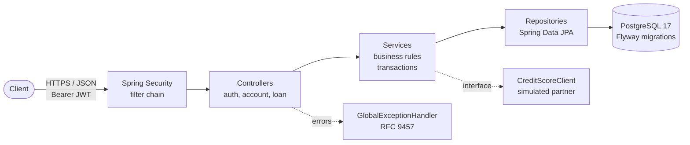

# LedgerLite

[](https://github.com/NikanEidi/ledgerlite/actions/workflows/ci.yml)
[](https://openjdk.org/)
[](https://spring.io/projects/spring-boot)
[](https://www.postgresql.org/)
[](#running-the-tests)
[](LICENSE)
[](compose.yaml)
[](pom.xml)

**A digital-bank core as a REST API.** Accounts, deposits, withdrawals, idempotent transfers, and loan decisions, built on Java 21 and Spring Boot 4 with a focus on correctness of money, security by default, and a documented, tested design.

> Personal project. Built step by step to demonstrate backend engineering practice in banking-style systems. See [limitations and roadmap](docs/05-limitations-and-roadmap.md) for what is not implemented.

---

## Highlights

- **Exact money.** `NUMERIC(19,4)` in PostgreSQL and `BigDecimal` in Java. Floating point is never used for amounts.
- **Invariants in the database and the domain.** A balance cannot go negative, a transfer cannot be zero or self-directed, and an email or account number cannot repeat, enforced by constraints and by entity methods.
- **Concurrency-safe transfers.** Accounts are locked with `SELECT ... FOR UPDATE`, always in a fixed order, which prevents deadlocks.
- **Idempotent transfers.** A retried request with the same `Idempotency-Key` returns the original result and moves money once.
- **Ownership by construction.** Every query on a user's data includes the owner, so another user's resource is indistinguishable from a missing one.
- **Stateless security.** JWT bearer authentication through Spring Security's resource server, BCrypt password hashing, and CSRF disabled for a token-only API.
- **Explicit state machine.** Loan applications move only along defined transitions, enforced in the enum and the entity.
- **Standard errors.** Every failure returns RFC 9457 `application/problem+json`.
- **Layered tests.** Fast unit tests for the money rules and integration tests against a real PostgreSQL 17 container.

## Architecture



The application is organized by feature, with a layered flow inside each feature. Domain rules live in entities (`Account.debit`, `LoanApplication.moveTo`), so no service can bypass them.

### Modules

| Module | Responsibility | Key classes |
|---|---|---|
| `auth` | registration, login, token issuance | `AuthService`, `JwtService`, `AuthController` |
| `account` | accounts, deposits, withdrawals, transfers | `Account`, `AccountService`, `Transfer` |
| `loan` | applications, state machine, decision | `LoanApplication`, `LoanStatus`, `LoanService` |
| `user` | identity and roles | `User`, `Role`, `UserRepository` |
| `config` | security chain, JWT beans, password encoder | `SecurityConfig`, `JwtProperties` |
| `common` | cross-cutting error mapping | `GlobalExceptionHandler` |

## Quick start

**Requirements:** Java 21, Docker. The Maven wrapper is included.

```bash
# 1. start PostgreSQL 17 (host port 5433)
docker compose up -d

# 2. run the application; Flyway applies the migrations on startup
./mvnw spring-boot:run
```

The API is available at `http://localhost:8080`.

### Running the tests

```bash
# all tests (requires Docker for the integration tests)
./mvnw test

# unit tests only, no Docker needed
./mvnw test -Dtest='AccountTest,LoanStatusTest'
```

## API

Endpoints marked **Token** require `Authorization: Bearer <token>`.

| Method | Path | Access | Purpose |
|---|---|---|---|
| `POST` | `/auth/register` | public | create a user |
| `POST` | `/auth/login` | public | obtain an access token |
| `GET` | `/auth/me` | token | identify the caller |
| `POST` | `/accounts` | token | open a `CHECKING` or `SAVINGS` account |
| `GET` | `/accounts` | token | list the caller's accounts |
| `GET` | `/accounts/{id}` | token | read one owned account |
| `POST` | `/accounts/{id}/deposits` | token | deposit funds |
| `POST` | `/accounts/{id}/withdrawals` | token | withdraw funds (rejected if insufficient) |
| `POST` | `/accounts/{id}/transfers` | token | transfer by account number; requires `Idempotency-Key` |
| `POST` | `/loans` | token | apply for a loan; decision returned immediately |
| `GET` | `/loans` | token | list the caller's applications |
| `GET` | `/loans/{id}` | token | read one owned application |
| `GET` | `/actuator/health` | public | health check |

### Error responses

| Status | Meaning in this API |
|---|---|
| `400` | invalid input, or source and destination are the same account |
| `401` | missing or invalid token, or wrong credentials |
| `404` | resource not found, or not owned by the caller |
| `409` | email already registered |
| `422` | valid request that violates a business rule (insufficient funds) |

### Example: idempotent transfer

```bash
TOKEN=$(curl -s -X POST http://localhost:8080/auth/login \
  -H "Content-Type: application/json" \
  -d '{"email":"user@example.com","password":"password123"}' \
  | python3 -c "import sys, json; print(json.load(sys.stdin)['accessToken'])")

curl -i -X POST http://localhost:8080/accounts/<SOURCE_ID>/transfers \
  -H "Authorization: Bearer $TOKEN" \
  -H "Idempotency-Key: 3f1c9e0a-0001-4b7e-9d1a-000000000001" \
  -H "Content-Type: application/json" \
  -d '{"toAccountNumber":"9175065905","amount":100.00}'
```

Repeating the same request with the same key returns the same transfer. The balances change once.

## Testing

| Layer | Tests | Infrastructure | Covers |
|---|---|---|---|
| Unit | 8 | none | balance rules, loan state transitions |
| Integration | 6 | PostgreSQL 17 via Testcontainers, `MockMvc` | context and migrations, registration and login, JWT protection, idempotent transfers, insufficient funds, ownership isolation |

The integration tests exercise the real security filter chain, the real migrations, and a real database. The idempotency test is the most important one: it proves that a retried transfer does not move money twice.

## Documentation

| Document | Purpose |
|---|---|
| [Technical reference](docs/README.md) | architecture, schema, endpoints, sequence diagrams, design decisions per module |
| [Limitations and roadmap](docs/05-limitations-and-roadmap.md) | what is not implemented, with priorities and the planned order |
| [Learning notes](learning/README.md) | one concept per lesson, with reasons, code, and common mistakes |

## Security notes

- Passwords are stored only as BCrypt hashes (`DelegatingPasswordEncoder`).
- Tokens are HS256 JWTs with a one-hour expiry. The secret comes from `JWT_SECRET_KEY` in production.
- Role assignment happens on the server. Registration cannot create an administrator.
- Authentication failures return the same message for unknown email and wrong password.
- Ownership checks are part of the data access, not a separate step that could be forgotten.

These points are a foundation, not a complete security review. Token revocation, rate limiting, and login lockout are on the roadmap.

## Roadmap

1. Security hardening: login rate limiting, amount precision validation, handling of deleted users.
2. Complete idempotency: body comparison, concurrent duplicates, deposits and withdrawals.
3. Double-entry ledger and transaction history.
4. Loan disbursement through the ledger.
5. Concurrency tests and continuous integration.

Full detail: [docs/05-limitations-and-roadmap.md](docs/05-limitations-and-roadmap.md).

## Tech stack

Java 21 · Spring Boot 4.1.1 · Spring Web MVC · Spring Data JPA · Hibernate 7 · Spring Security (OAuth2 resource server, Nimbus JWT) · Jakarta Bean Validation · PostgreSQL 17 · Flyway · Testcontainers · JUnit 6 · AssertJ · Docker Compose · Maven

## License

Released under the [MIT License](LICENSE).

## Author

**Nikan Eidi** · [GitHub](https://github.com/NikanEidi) · [Portfolio](https://nikanvision.dev) · [LinkedIn](https://www.linkedin.com/in/nikan-eidi-03476232b)
