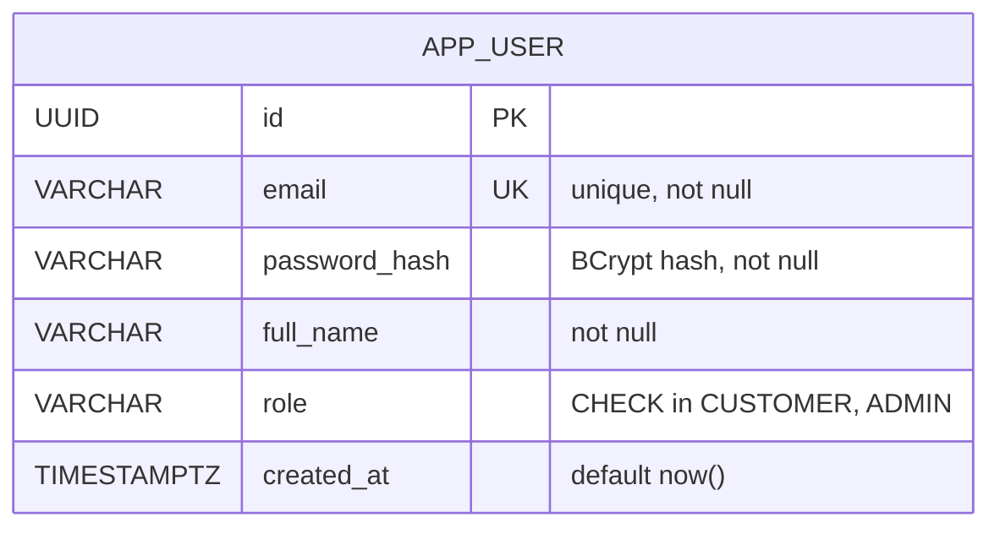
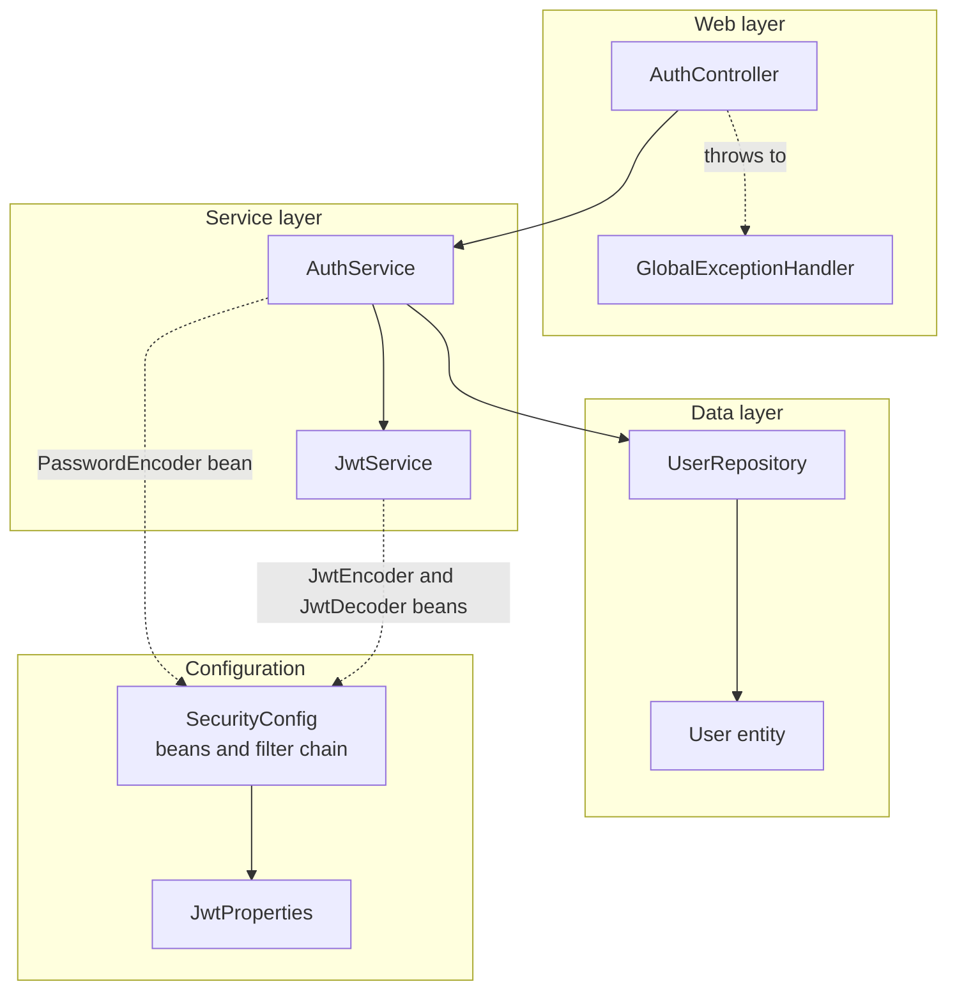
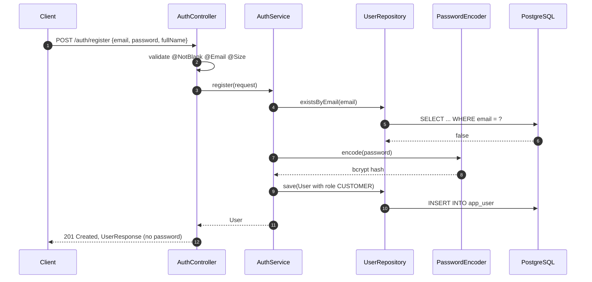
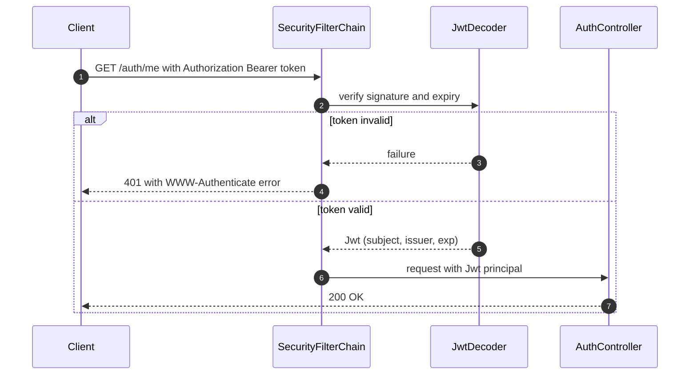

# Auth Module: Technical Reference

**Status:** Done and tested end to end.
**Packages:** `auth`, `user`, `config`, `common`

This document describes what the Auth module does, how its parts connect, and why each design decision was made. For a step-by-step explanation intended for learning, see [learning/01-auth.md](../learning/01-auth.md).

---

## 1. Responsibilities

- Register a user with an email, a password, and a full name.
- Store only a BCrypt hash of the password, never the raw password.
- Log a user in and issue a signed JSON Web Token (JWT) valid for one hour.
- Require a valid bearer token on every endpoint except the public ones.
- Return all errors as RFC 9457 `application/problem+json` responses.

## 2. Endpoints

| Method | Path | Access | Success | Failure cases |
|---|---|---|---|---|
| POST | `/auth/register` | Public | `201 Created`, body is `UserResponse` | `400` invalid input, `409` email already used |
| POST | `/auth/login` | Public | `200 OK`, body is `LoginResponse` | `400` invalid input, `401` wrong email or password |
| GET | `/auth/me` | Bearer token | `200 OK`, text with the subject email | `401` missing, malformed, or expired token |
| GET | `/actuator/health` | Public | `200 OK` | none |

## 3. Data model



Migration: `src/main/resources/db/migration/V1__create_app_user.sql`.

## 4. Component structure



Solid arrows are direct dependencies (constructor injection). Dashed arrows are beans supplied by Spring.

## 5. Sequence diagrams

### 5.1 Register



### 5.2 Login


Both failure branches return the same error message. This prevents user enumeration.

### 5.3 Calling a protected endpoint



## 6. Error handling

| Exception | Handler | HTTP status | Source |
|---|---|---|---|
| `EmailAlreadyUsedException` | `GlobalExceptionHandler` | 409 | `AuthService.register` |
| `InvalidCredentialsException` | `GlobalExceptionHandler` | 401 | `AuthService.login` |
| `MethodArgumentNotValidException` | `GlobalExceptionHandler` | 400 | request validation |

**Why a global handler is needed.** An exception that no handler catches is forwarded by Spring Boot to `/error`. The `/error` path is not on the public list, so the security filter rejects that internal request with a misleading `403`. The global handler catches the exception first, so the forward never happens.

## 7. Configuration

```yaml
security:
  jwt:
    secret-key: ${JWT_SECRET_KEY:...local development value...}
```

- The key is read by `JwtProperties` through `@ConfigurationProperties`.
- HS256 requires at least 32 bytes. Production must set `JWT_SECRET_KEY` from the environment.
- The default in the file is for local development only.

## 8. Token format

| Claim | Value |
|---|---|
| `iss` | `ledgerlite` |
| `sub` | user email |
| `iat` | issue time |
| `exp` | issue time plus 1 hour |
| header `alg` | `HS256` |

## 9. Design decisions

| Decision | Reason |
|---|---|
| UUID primary keys | IDs cannot be guessed or enumerated |
| BCrypt through `DelegatingPasswordEncoder` | Standard one-way hash. The `{bcrypt}` prefix allows a future algorithm change |
| Role set on the server | The request body has no `role` field, so a client cannot register as ADMIN |
| Same message for unknown email and wrong password | Prevents user enumeration |
| Stateless JWT, CSRF disabled | No cookies or sessions, so CSRF does not apply |
| Spring's built-in Nimbus JWT support | One fewer third-party dependency |
| Flyway with `ddl-auto: none` | Schema changes are versioned and reviewed like code |
| DTOs for input and output | The entity, including `passwordHash`, is never serialized |
| `ProblemDetail` (RFC 9457) | One error format across the whole API |

## 10. Known limits

- Access tokens cannot be revoked before they expire. A refresh-token flow would be needed for that.
- The JWT secret in the repository is for local development only.
