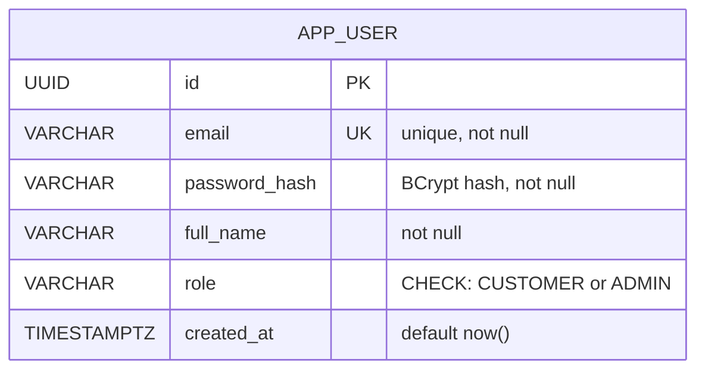
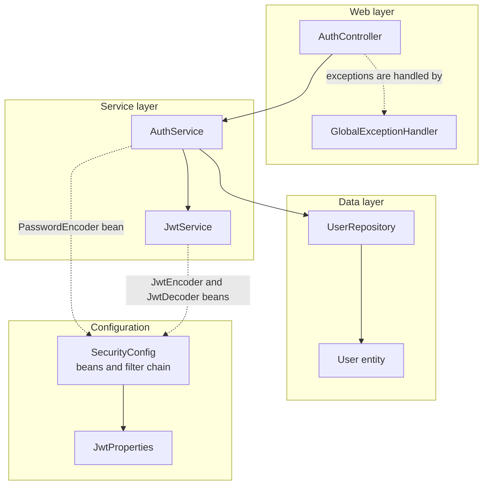
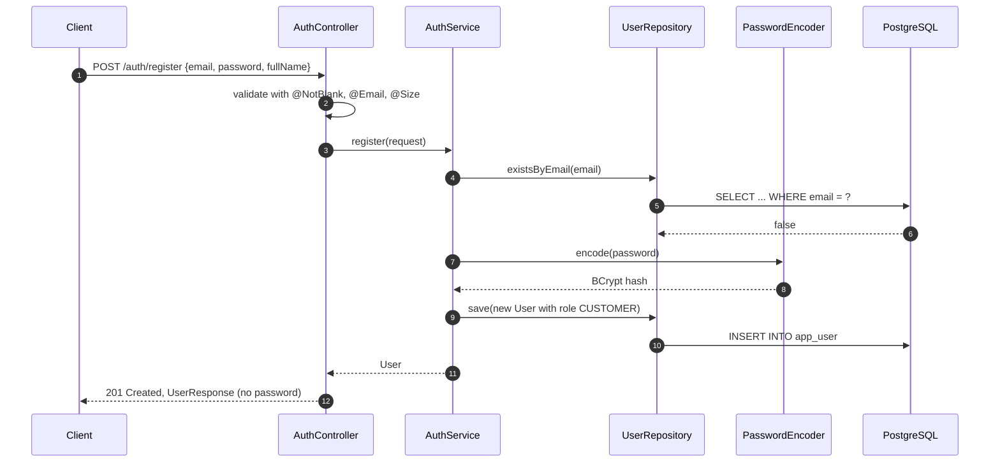
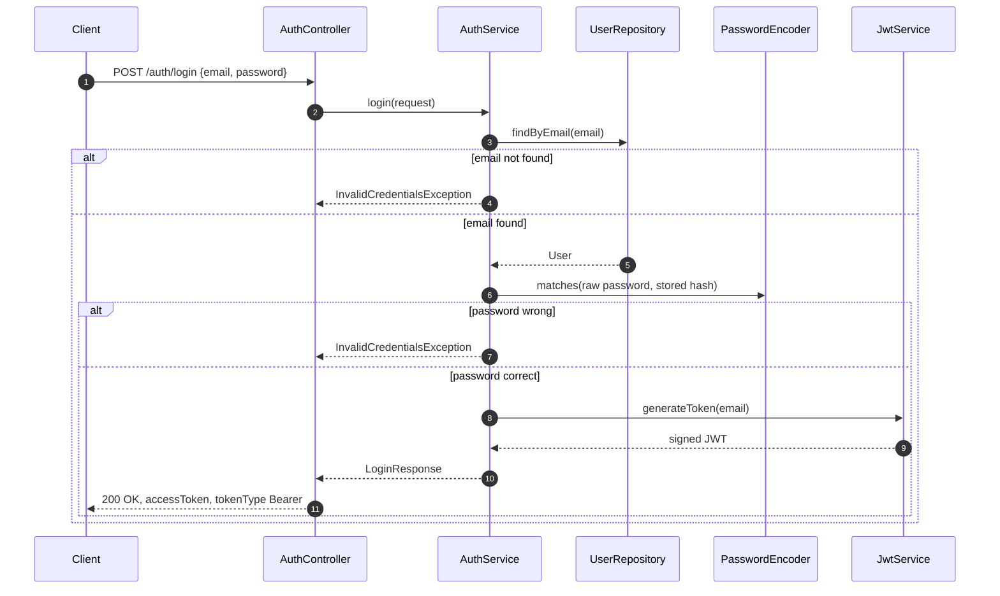
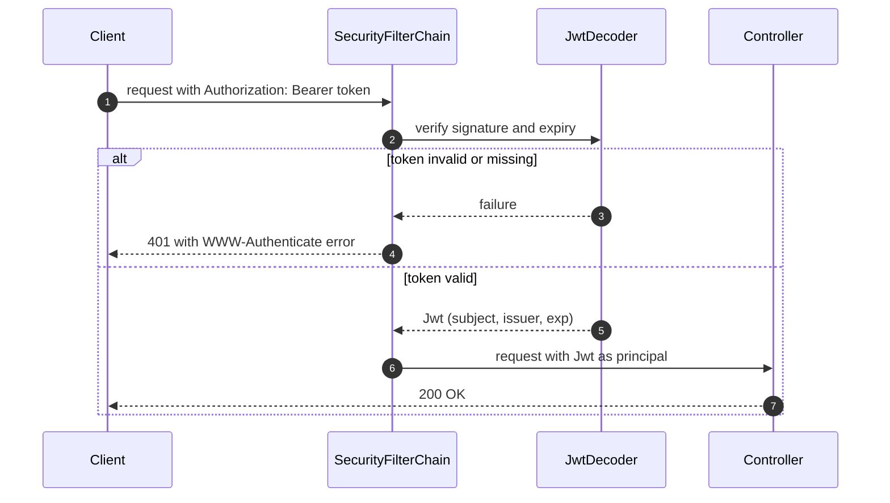

# Auth Module: Technical Reference

**Status:** Done and covered by tests.
**Packages:** `auth`, `user`, `config`, `common`

This document describes how authentication works in LedgerLite: registration, login, token issuance, and how protected endpoints check the token. For a step-by-step explanation of the same code, see [learning/01-auth.md](../learning/01-auth.md).

---

## 1. Responsibilities

- Register a user with an email, a password, and a full name.
- Store only a BCrypt hash of the password, never the raw password.
- Log a user in and issue a signed JSON Web Token (JWT) that is valid for one hour.
- Require a valid bearer token on every endpoint except the public ones.
- Return every error in the RFC 9457 `application/problem+json` format.

## 2. Endpoints

| Method | Path | Access | Success | Failure cases |
|---|---|---|---|---|
| POST | `/auth/register` | Public | `201 Created`, body is `UserResponse` | `400` invalid input, `409` email already used |
| POST | `/auth/login` | Public | `200 OK`, body is `LoginResponse` | `400` invalid input, `401` wrong email or password |
| GET | `/auth/me` | Bearer token | `200 OK`, plain text with the subject email | `401` missing, malformed, or expired token |
| GET | `/actuator/health` | Public | `200 OK` | none |

## 3. Data model



Migration: `src/main/resources/db/migration/V1__create_app_user.sql`.

## 4. Component structure



Solid arrows are direct dependencies (constructor injection). Dashed arrows are beans supplied by Spring.

## 5. Sequence diagrams

### 5.1 Register



### 5.2 Login



Both failure branches return the same message. This prevents user enumeration: an attacker cannot tell which emails are registered.

### 5.3 Calling a protected endpoint



The controller never parses the token itself. It receives an already verified `Jwt` through `@AuthenticationPrincipal`, and uses `jwt.getSubject()` to know who is calling.

## 6. Error handling

| Exception | HTTP status | Raised when |
|---|---|---|
| `EmailAlreadyUsedException` | 409 Conflict | registering an email that already exists |
| `InvalidCredentialsException` | 401 Unauthorized | unknown email or wrong password |
| `MethodArgumentNotValidException` | 400 Bad Request | a request field fails validation |

**Why a global handler is needed.** When no handler catches an exception, Spring Boot forwards the request internally to `/error`. That path is not public, so the security filter rejects the forward with a misleading `403`. The global handler catches the exception first, so the forward never happens.

## 7. Configuration

```yaml
security:
  jwt:
    secret-key: ${JWT_SECRET_KEY:...local development value...}
```

- `JwtProperties` reads the key through `@ConfigurationProperties`.
- HS256 needs at least 32 bytes.
- The default value is for local development only. Production must set `JWT_SECRET_KEY` in the environment.

## 8. Token format

| Claim | Value |
|---|---|
| `iss` | `ledgerlite` |
| `sub` | user email |
| `iat` | issue time |
| `exp` | issue time plus one hour |
| header `alg` | `HS256` |

## 9. Design decisions

| Decision | Reason |
|---|---|
| UUID primary keys | IDs cannot be guessed or enumerated |
| BCrypt through `DelegatingPasswordEncoder` | Standard one-way hash. The `{bcrypt}` prefix allows a future algorithm change |
| Role set on the server | The request has no role field, so a client cannot register as ADMIN |
| Same message for unknown email and wrong password | Prevents user enumeration |
| Stateless JWT, CSRF disabled | No cookies or sessions, so CSRF does not apply |
| Spring's built-in Nimbus JWT support | One fewer third-party dependency |
| Flyway with `ddl-auto: none` | Schema changes are versioned and reviewed like code |
| DTOs for input and output | The entity, including `passwordHash`, is never serialized |
| RFC 9457 `ProblemDetail` | One error format across the whole API |

## 10. Scope and limitations

Features that are not implemented, and behaviors that are known to be incomplete, are listed in one place: [05-limitations-and-roadmap.md](05-limitations-and-roadmap.md), section 1.
