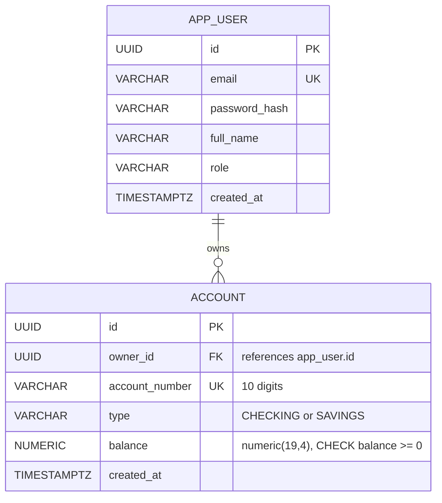
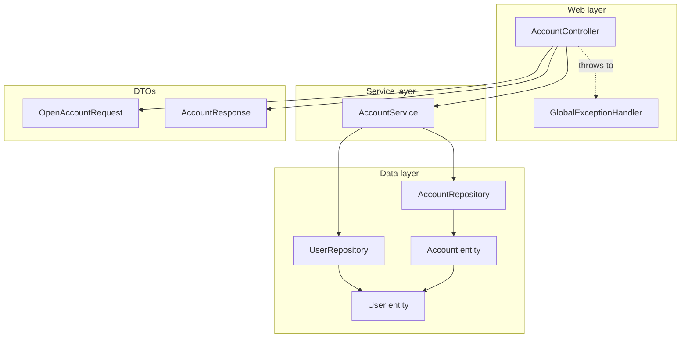
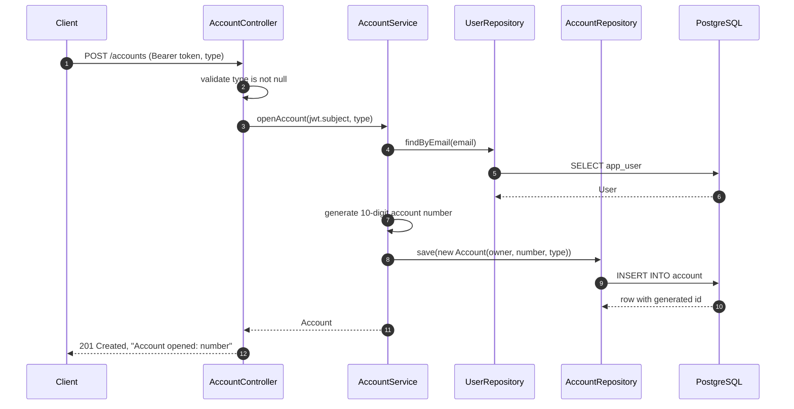
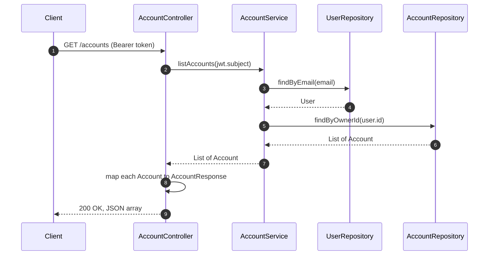
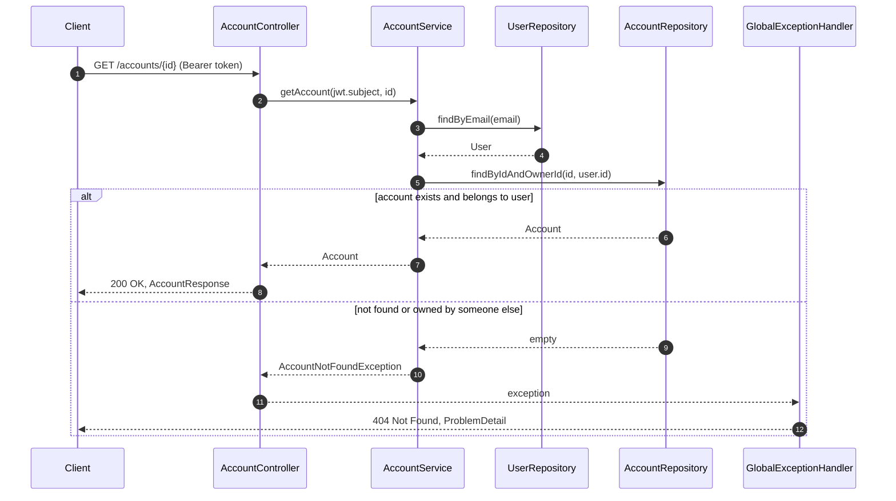

# Accounts Module: Technical Reference

**Status:** Opening, listing, and reading accounts are done and tested. Balance changes (deposit, withdraw, transfer) are planned.
**Packages:** `account`, with dependencies on `user` and `common`

This document describes the Accounts module as it currently exists. For a step-by-step explanation intended for learning, see [learning/02-accounts.md](../learning/02-accounts.md).

---

## 1. Responsibilities

- Open a bank account for the authenticated user.
- List the authenticated user's accounts.
- Return one account by ID, but only if it belongs to the authenticated user.
- Store money as exact decimal values, never as floating-point numbers.
- Enforce ownership, uniqueness, and non-negative balances in the database.

## 2. Endpoints

All endpoints require a bearer token. The owner is always taken from the token's subject, never from the request.

| Method | Path | Request body | Success | Failure cases |
|---|---|---|---|---|
| POST | `/accounts` | `{"type": "CHECKING" or "SAVINGS"}` | `201 Created`, plain text `Account opened: <number>` | `400` invalid type, `401` no token |
| GET | `/accounts` | none | `200 OK`, JSON array of `AccountResponse` | `401` no token |
| GET | `/accounts/{id}` | none | `200 OK`, one `AccountResponse` | `404` not found or not owned, `401` no token |

Note: the POST response is currently plain text. Changing it to return an `AccountResponse` JSON body is a planned improvement.

## 3. Data model

Migration: `src/main/resources/db/migration/V2__create_account.sql`.

| Constraint | Column | What it guarantees |
|---|---|---|
| Primary key | `account.id` | Each account has one unique identifier |
| Foreign key | `account.owner_id` | An account always points to an existing user |
| Unique | `account.account_number` | No two accounts share a number |
| Check | `account.type` | Only the two allowed types are stored |
| Check | `account.balance` | The balance can never be negative |
| Index | `account.owner_id` | Listing one user's accounts is fast |

## 4. Component structure

## 5. Sequence diagrams

### 5.1 Open an account

### 5.2 List my accounts

### 5.3 Read one account (ownership check)

The query uses both `id` and `owner_id` in one `WHERE` clause. A user who guesses another user's account ID receives the same `404` as for an ID that does not exist.

## 6. Error handling

| Exception | Handler | HTTP status | Raised when |
|---|---|---|---|
| `AccountNotFoundException` | `GlobalExceptionHandler` | 404 | account missing or not owned by the caller |
| `MethodArgumentNotValidException` | `GlobalExceptionHandler` | 400 | `type` is missing or not `CHECKING` or `SAVINGS` |
| `IllegalStateException` | none yet | 500 | the authenticated user is missing from the database |

The last row is a known gap. It occurs only if a valid token refers to a user that was deleted after the token was issued.

## 7. Money representation

| Layer | Type | Reason |
|---|---|---|
| Database | `NUMERIC(19,4)` | Exact decimal with 4 places |
| Java | `BigDecimal` | Exact arithmetic |
| JSON | decimal number, shown as `0.0000` | Keeps the fixed scale |
| Forbidden | `double`, `float` | Binary floating point cannot represent `0.1` exactly |

## 8. Design decisions

| Decision | Reason |
|---|---|
| Owner comes from the JWT subject | The client cannot open an account for another user |
| Account number generated on the server | The client cannot choose or guess numbers |
| `SecureRandom` for account numbers | Numbers are hard to predict |
| `findByIdAndOwnerId` | Ownership is enforced in the query, not in code after the fetch |
| `404` for foreign accounts | Hides whether another user's account exists |
| `updatable = false` on owner, number, type | An account cannot change owner or type after creation |
| `balance` has no setter | Balance changes only through domain methods (planned) |
| `@Transactional(readOnly = true)` on reads | Signals read-only work to the database and to Hibernate |
| `FetchType` left at default for `owner` | Documented as a possible optimization (see Known limits) |

## 9. Known limits

- **Account number collisions.** A duplicate number is rejected by the `UNIQUE` constraint, but the code does not retry. A user would see a `500` in that rare case.
- **Eager loading of owner.** `@ManyToOne` defaults to eager fetching. Switching to `FetchType.LAZY` is planned when list performance matters.
- **No balance operations yet.** Deposit, withdraw, and transfer are not implemented, so `balance` is always zero.
- **Concurrency for money.** Balance changes will need locking (optimistic with `@Version`, or pessimistic) before transfers are added.
- **Plain-text open response.** The POST response will become a JSON `AccountResponse`.
