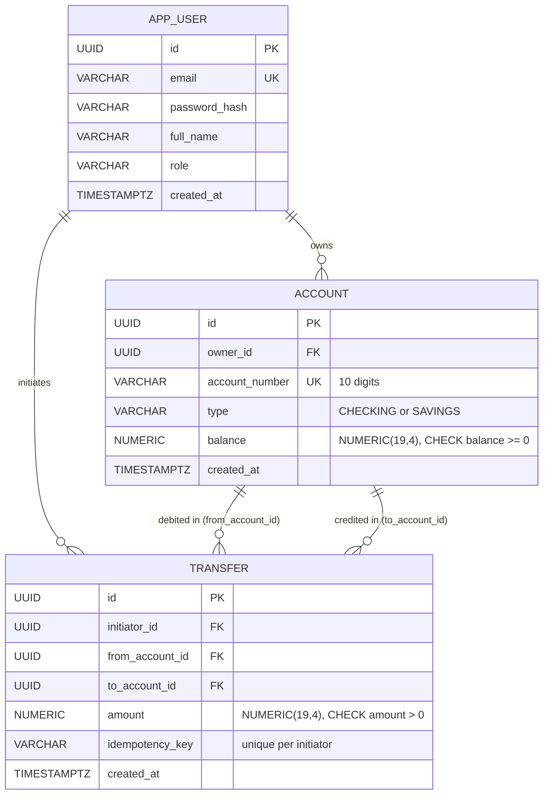
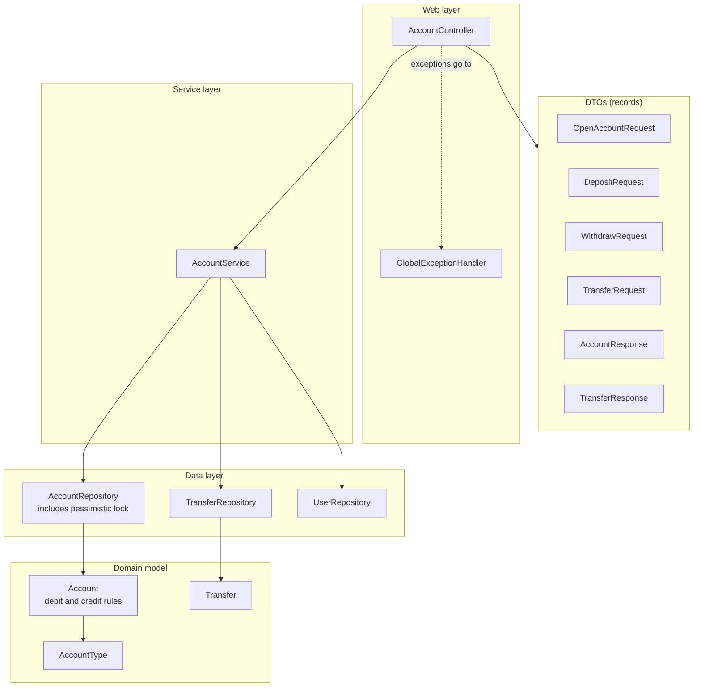
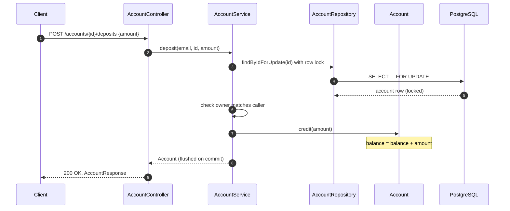
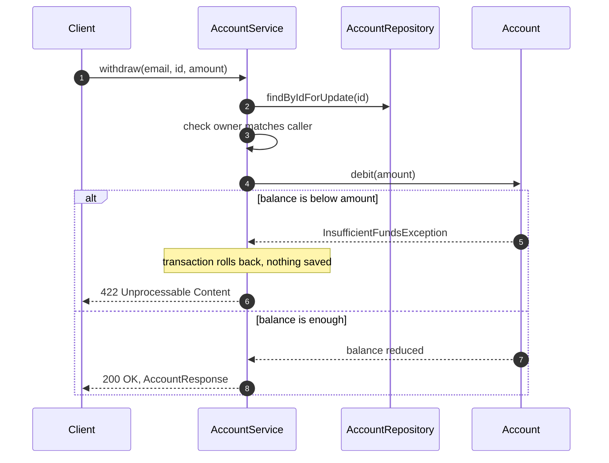
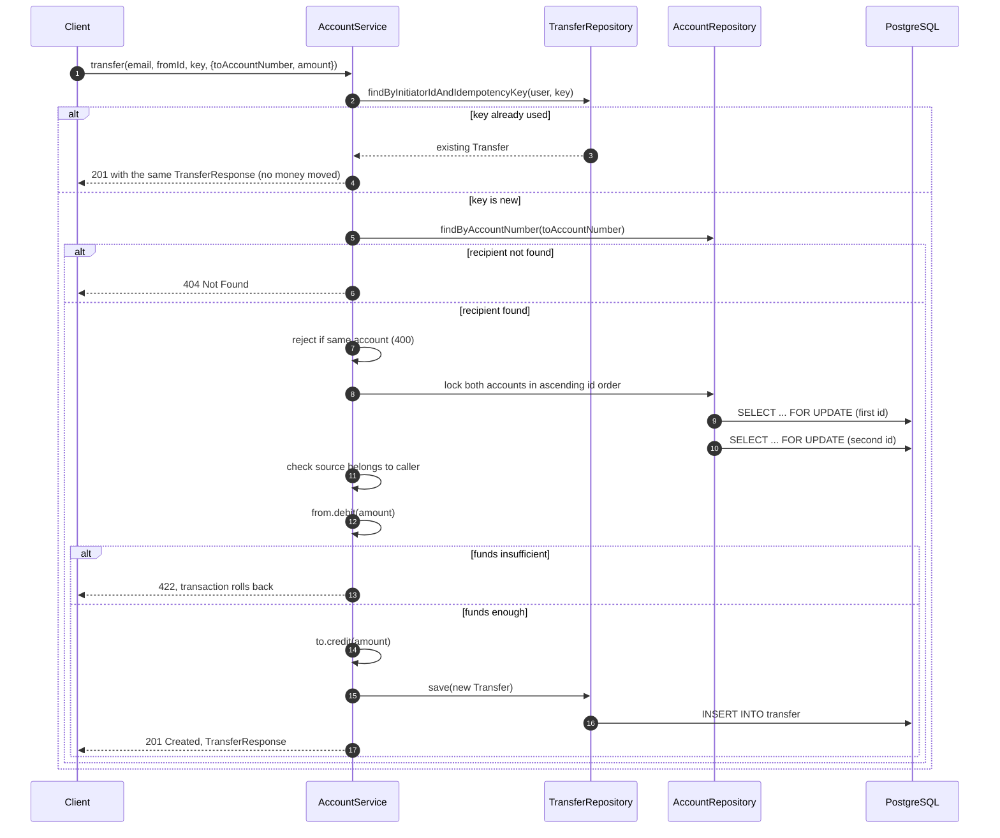
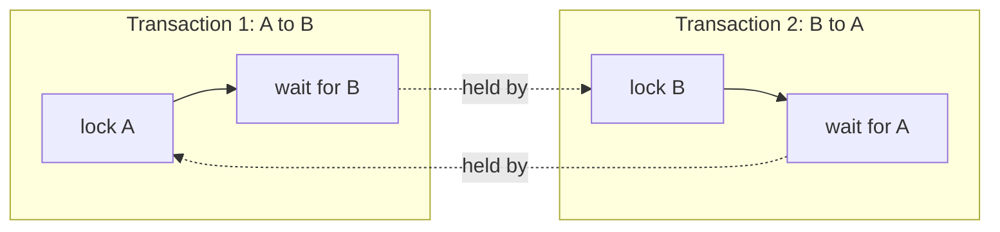

# Accounts Module: Technical Reference

**Status:** Done and covered by tests. Accounts, deposits, withdrawals, and transfers work end to end.
**Packages:** `account`, with dependencies on `user` and `common`

This document describes the accounts module: opening accounts, reading them, changing balances (deposit, withdrawal, transfer), and the rules that keep money correct. For a step-by-step explanation of the same code, see [learning/02-accounts.md](../learning/02-accounts.md).

---

## 1. Responsibilities

- Open a `CHECKING` or `SAVINGS` account for the authenticated user.
- List the user's accounts and read one of them.
- Deposit money into an owned account.
- Withdraw money from an owned account, only if the balance covers it.
- Transfer money from an owned account to any account by its number, exactly once per idempotency key.
- Store money as exact decimals and enforce non-negative balances in the database.

## 2. Endpoints

All endpoints require a bearer token. The owner is always taken from the token's subject, never from the request body.

| Method | Path | Request | Success | Failure cases |
|---|---|---|---|---|
| POST | `/accounts` | `{"type": "CHECKING"}` or `"SAVINGS"` | `201`, plain text `Account opened: <number>` | `400` invalid type, `401` no token |
| GET | `/accounts` | none | `200`, JSON array of `AccountResponse` | `401` no token |
| GET | `/accounts/{id}` | none | `200`, `AccountResponse` | `404` not found or not owned, `401` |
| POST | `/accounts/{id}/deposits` | `{"amount": 500.00}` | `200`, updated `AccountResponse` | `400` invalid amount, `404` not owned, `401` |
| POST | `/accounts/{id}/withdrawals` | `{"amount": 50.00}` | `200`, updated `AccountResponse` | `400` invalid amount, `404` not owned, `422` insufficient funds, `401` |
| POST | `/accounts/{id}/transfers` | `{"toAccountNumber": "...", "amount": 100.00}` plus header `Idempotency-Key` | `201`, `TransferResponse` | `400` same account or missing key, `404` recipient or source not found, `422` insufficient funds, `401` |

Note: the account-opening response is plain text. See [05-limitations-and-roadmap.md](05-limitations-and-roadmap.md).

## 3. Data model

Migrations: `V2__create_account.sql` and `V3__create_transfer.sql`.

### Constraints that protect the data

| Table | Constraint | What it guarantees |
|---|---|---|
| `account` | primary key on `id` | each account has one identifier |
| `account` | foreign key `owner_id` | an account always belongs to an existing user |
| `account` | unique `account_number` | no two accounts share a number |
| `account` | check `type` | only `CHECKING` or `SAVINGS` |
| `account` | check `balance >= 0` | a balance can never be negative, even if the code has a bug |
| `transfer` | check `amount > 0` | zero or negative transfers are impossible |
| `transfer` | check `from_account_id <> to_account_id` | an account cannot transfer to itself |
| `transfer` | unique `(initiator_id, idempotency_key)` | a retried request cannot create a second transfer |

## 4. Component structure

## 5. Sequence diagrams

### 5.1 Deposit

### 5.2 Withdrawal

### 5.3 Transfer (with locking and idempotency)

## 6. Why locking is needed and how it is ordered

Two transfers can run at the same time. Without locks, both could read the same balance, both see enough money, and both withdraw it. The balance would then be wrong.

`PESSIMISTIC_WRITE` locks a row until the transaction ends. Any other transaction that wants the same row waits.

Locking two accounts creates a new risk, a **deadlock**:

The fix is one global order. The service always locks the account with the smaller UUID first, whatever the direction of the transfer. Both transactions then want the same first lock, so one waits for the other instead of both waiting forever.

## 7. Error handling

| Exception | HTTP status | Raised when |
|---|---|---|
| `AccountNotFoundException` | 404 | the account does not exist, or belongs to someone else |
| `RecipientAccountNotFoundException` | 404 | no account has the destination number |
| `InsufficientFundsException` | 422 | a debit would make the balance negative |
| `SameAccountTransferException` | 400 | source and destination are the same account |
| `MethodArgumentNotValidException` | 400 | an amount is missing, zero, negative, or the type is invalid |

A foreign account returns `404`, the same as a missing one. A user who guesses another account's ID learns nothing.

## 8. Money representation

| Layer | Type | Reason |
|---|---|---|
| Database | `NUMERIC(19,4)` | exact decimal, 4 places after the point |
| Java | `BigDecimal` | exact arithmetic, no binary rounding |
| JSON response | decimal, scaled to 4 places | the same format everywhere (`setScale(4)`) |
| Forbidden | `double`, `float` | `0.1` cannot be represented exactly in binary |

## 9. Design decisions

| Decision | Reason |
|---|---|
| Owner comes from the JWT subject | a client cannot act on another user's account |
| Account number generated on the server | the client cannot choose or guess numbers |
| `SecureRandom` for account numbers | numbers are hard to predict |
| Ownership checked in the query or right after locking | a non-owner never gets a usable balance |
| Balance rules live in `Account.debit` and `credit` | no code path can change a balance around the rule |
| No setter for `balance` | the only ways to change it are the named methods |
| Pessimistic lock on transfers | the simplest correct choice when the same account is written by many requests |
| Lock order by UUID | prevents deadlock between opposite transfers |
| Idempotency key stored per initiator | a retry returns the original result, and two users cannot collide |
| `@Transactional` on every money method | a failure in the middle rolls back everything |
| `updatable = false` on owner, number, type, amounts of transfers | immutable facts stay immutable |

## 10. Scope and limitations

Features that are not implemented, and behaviors that are known to be incomplete, are listed in one place: [05-limitations-and-roadmap.md](05-limitations-and-roadmap.md), section 2.
