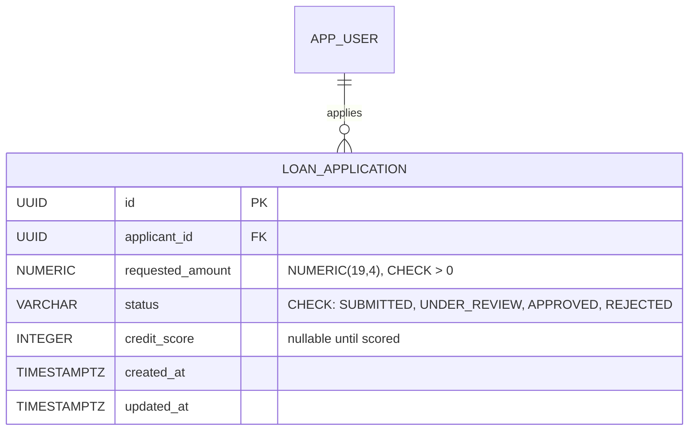
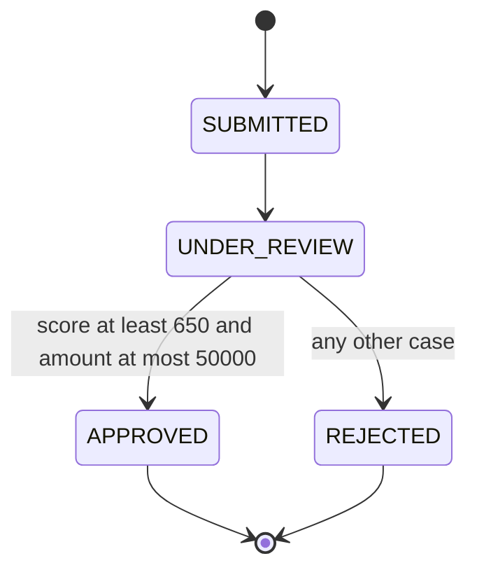
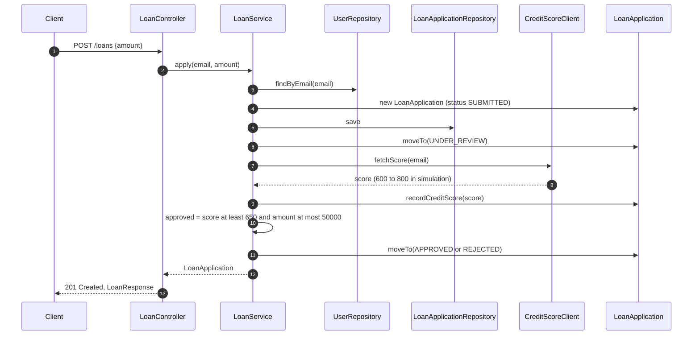
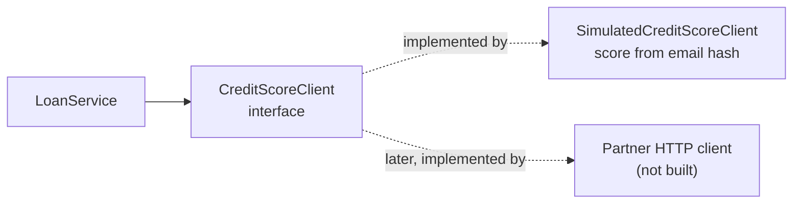

# Loans Module: Technical Reference

**Status:** Done. Applications are submitted, scored, and decided in one request. The credit-score source is simulated.
**Packages:** `loan`, with a dependency on `user`

This document describes the loan module: how an application moves through its states, how the decision is made, and what is simulated. For a step-by-step explanation of the same code, see [learning/03-loans.md](../learning/03-loans.md).

---

## 1. Responsibilities

- Accept a loan application for the authenticated user.
- Move the application through a fixed set of states, and never allow an undefined move.
- Get a credit score from an external partner (simulated in this project).
- Decide the outcome with a clear rule: approve or reject.
- Let the user list their applications and read one, only if it belongs to them.

## 2. Endpoints

| Method | Path | Request | Success | Failure cases |
|---|---|---|---|---|
| POST | `/loans` | `{"amount": 10000.00}` | `201 Created`, `LoanResponse` with final status | `400` invalid amount, `401` no token |
| GET | `/loans` | none | `200`, array of `LoanResponse` | `401` no token |
| GET | `/loans/{id}` | none | `200`, `LoanResponse` | `404` not found or not owned, `401` |

The response to `POST /loans` already contains the final status (`APPROVED` or `REJECTED`), because the whole decision is made synchronously.

## 3. Data model

Migration: `V4__create_loan_application.sql`.

## 4. State machine

A loan application can only move along the paths below. The rules live in `LoanStatus.canTransitionTo`, and `LoanApplication.moveTo` enforces them.

| From | Allowed next states | Notes |
|---|---|---|
| `SUBMITTED` | `UNDER_REVIEW` | the only move out of the start |
| `UNDER_REVIEW` | `APPROVED`, `REJECTED` | the decision |
| `APPROVED` | none | final |
| `REJECTED` | none | final |

Any other move throws `IllegalStateException`. That is a programming error, not a user error, so it should never happen in normal use.

## 5. Sequence diagram: apply for a loan

All of this runs in one transaction. Intermediate states (`SUBMITTED`, `UNDER_REVIEW`) are never visible to other requests, because they are committed together with the final state.

## 6. Decision rule

| Condition | Result |
|---|---|
| score at least 650 and requested amount at most 50,000 | `APPROVED` |
| anything else | `REJECTED` |

The constants `MIN_APPROVAL_SCORE` and `MAX_APPROVED_AMOUNT` are in `LoanService`. Moving them to configuration would let them change without a code change.

## 7. The credit-score boundary

`LoanService` depends only on the interface. The simulation gives the same score for the same email every time, which keeps tests predictable. A real partner client can replace it later without changing the service.

## 8. Error handling

| Exception | HTTP status | Raised when |
|---|---|---|
| `LoanNotFoundException` | 404 | the loan does not exist, or belongs to someone else |
| `MethodArgumentNotValidException` | 400 | the amount is missing, zero, or negative |
| `IllegalStateException` | 500 | an illegal state move (a bug, not expected in use) |

A `REJECTED` loan is not an error. The request succeeds with `201`, and the body says `REJECTED`. A rejection is a valid business result.

## 9. Design decisions

| Decision | Reason |
|---|---|
| Explicit state enum with a transition method | illegal states become impossible to reach through normal code |
| `moveTo` is the only way to change status | no code can skip a state |
| Decision inside one transaction | the outcome is saved together with its inputs |
| Credit score behind an interface | the external dependency can be swapped or faked |
| Same score for the same email in simulation | tests are repeatable |
| Final status returned from `POST` | the client does not need a second call to learn the result |
| No status column changed by the client | the server alone decides the outcome |

## 10. Scope and limitations

Features that are not implemented, and behaviors that are known to be incomplete, are listed in one place: [05-limitations-and-roadmap.md](05-limitations-and-roadmap.md), section 3.
