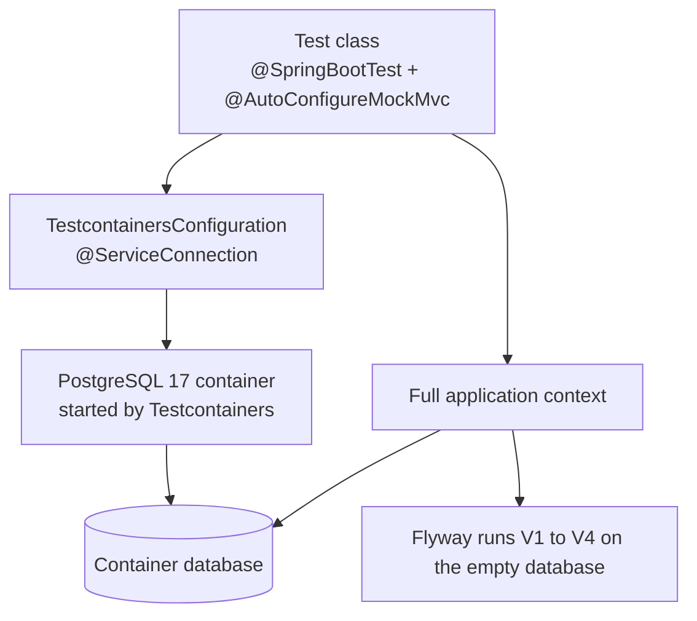

# Testing: Technical Reference

**Status:** 14 automated tests, all passing. Unit tests for business rules, and integration tests against a real PostgreSQL 17 container.
**Tools:** JUnit 6, AssertJ, Mockito (available), Testcontainers 2, Spring Boot test support (`MockMvc`).

For a step-by-step explanation of the testing approach, see [learning/04-testing.md](../learning/04-testing.md).

---

## 1. Test pyramid

```
            +----------------------+
            |  Integration tests   |  5 + 1 context test
            |  real Spring + DB    |  slow (seconds), high confidence
            +----------------------+
          +--------------------------+
          |       Unit tests         |  8 tests
          |  pure Java, no Spring    |  fast (milliseconds), precise
          +--------------------------+
```

The domain rules that move money are covered by fast unit tests. The flows that cross layers (HTTP, security, database, locking) are covered by integration tests.

## 2. Test inventory

| Class | Type | Tests | What it proves |
|---|---|---|---|
| `AccountTest` | unit | 4 | new balance is zero, credit adds, debit subtracts when funded, debit is rejected when short and leaves the balance untouched |
| `LoanStatusTest` | unit | 4 | allowed loan transitions, and that final states have no exits (parameterized over every target) |
| `LedgerliteApplicationTests` | integration | 1 | the whole application context starts, Flyway migrations run, and the repositories are wired |
| `AccountFlowIntegrationTest` | integration | 5 | register and login, JWT protection, deposit then transfer with idempotent replay, rejection beyond balance, ownership isolation |

## 3. Integration test setup



- `@ServiceConnection` tells Spring Boot to use the container's connection details instead of `application.yaml`. The tests never touch the local development database.
- Every test class starts with an empty database, so tests do not depend on each other.
- `MockMvc` sends real HTTP-shaped requests through the security filter chain without opening a port.

## 4. Important test cases

### 4.1 Idempotent transfer

The test deposits 500 into a checking account, then sends the same transfer twice with the same `Idempotency-Key`.

Expected results:
- both responses have the same transfer `id`
- the source balance is 400, not 300
- the target balance is 100

This is the most important test in the project, because it proves that a retried request does not move money twice.

### 4.2 Ownership isolation

One user creates an account. A second user asks for it by ID. The response is `404`, the same as for an ID that does not exist.

### 4.3 Balance rule through HTTP

A transfer larger than the balance returns `422`. The test checks the status only. The unit test `AccountTest` already proves that the balance is unchanged after a rejected debit.

## 5. How to run the tests

Docker must be running, because the integration tests start a PostgreSQL container.

```bash
# all tests
./mvnw test

# only fast unit tests (no Docker needed)
./mvnw test -Dtest='AccountTest,LoanStatusTest'

# only the integration tests
./mvnw test -Dtest='AccountFlowIntegrationTest'
```

## 6. Scope and limitations

Features that are not implemented, and behaviors that are known to be incomplete, are listed in one place: [05-limitations-and-roadmap.md](05-limitations-and-roadmap.md), section 4.
