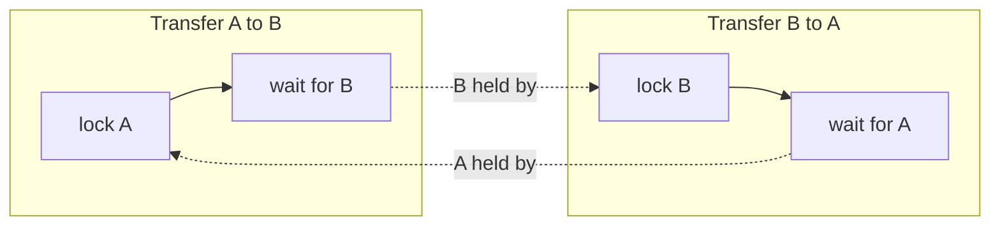

# Learning Notes 2: Accounts and Money Movement

These notes explain the accounts module one concept at a time. Money is the hardest part of a bank API, so most lessons here are about keeping money correct when many requests run at the same time.

Each lesson gives the idea, the reason, the code from this project, a common mistake, and a sentence you can use in an interview.

The technical reference for the same module is in [docs/02-accounts.md](../docs/02-accounts.md).

## Lesson map

| Lesson | Concept | Where it appears |
|---|---|---|
| 1 | Money is never a `double` | `balance` in `Account`, `NUMERIC(19,4)` |
| 2 | Relationships and foreign keys | `owner` in `Account`, `owner_id` |
| 3 | Fields that never change | `updatable = false` |
| 4 | Enums stored as text | `AccountType` |
| 5 | Queries generated from method names | `findByOwnerId`, `findByIdAndOwnerId` |
| 6 | Ownership and the 404 rule | `AccountService.getAccount` |
| 7 | Transactions | `@Transactional` |
| 8 | Random account numbers | `SecureRandom` |
| 9 | Safe output with a DTO | `AccountResponse` |
| 10 | Business rules live in the entity | `Account.debit` and `Account.credit` |
| 11 | Pessimistic locking | `findByIdForUpdate` |
| 12 | Lock ordering prevents deadlock | `AccountService.transfer` |
| 13 | Idempotency keys | `Transfer`, `TransferRepository` |
| 14 | Money in both directions in one transaction | `transfer` |

---

## Lesson 1: Money is not a `double`

**Idea.** A `double` stores binary fractions. Many decimal values, such as `0.1`, cannot be stored exactly.

**Why it matters.** In Java, `0.1 + 0.2` gives `0.30000000000000004`. Over thousands of operations, the errors add up to real money.

**Code.**
```sql
balance NUMERIC(19, 4) NOT NULL DEFAULT 0 CHECK (balance >= 0)
```
```java
@Column(nullable = false, precision = 19, scale = 4)
private BigDecimal balance = BigDecimal.ZERO;
```

`NUMERIC(19,4)` stores up to 19 digits, 4 of them after the point. `BigDecimal` does exact decimal arithmetic. The two must match, which is why the Java field repeats `precision` and `scale`.

**Common mistake.** Using `double` because it is convenient. Tests pass with small numbers, then production shows missing cents.

**Interview line.** "I store money as NUMERIC in the database and BigDecimal in Java, never as floating point, so the arithmetic is exact."

---

## Lesson 2: Relationships and foreign keys

**Idea.** An account belongs to one user, and a user can have many accounts.

**Why it matters.** A foreign key lets the database reject an account whose owner does not exist. This rule holds even if application code has a bug.

**Code.**
```sql
owner_id UUID NOT NULL REFERENCES app_user (id)
```
```java
@ManyToOne(optional = false)
@JoinColumn(name = "owner_id", nullable = false, updatable = false)
private User owner;
```

The SQL is the database rule. The annotations tell Hibernate about the same relationship.

**Common mistake.** Storing `owner_id` as a plain `UUID` with no foreign key. Then orphan accounts can exist.

**Interview line.** "Accounts reference their owner through a foreign key, so the database guarantees referential integrity."

---

## Lesson 3: Fields that never change

**Idea.** Some facts about an account must never change after creation: its owner, its number, its type.

**Why it matters.** If a checking account could silently become savings, the history of the account would be meaningless.

**Code.**
```java
@Column(name = "account_number", nullable = false, unique = true, updatable = false)
private String accountNumber;
```

`updatable = false` tells Hibernate never to include the column in an `UPDATE`. The database would still allow it, so this is an application-level guard.

**Balance is different.** It must change, so it is updatable. It has no setter, so it can change only through named methods that enforce rules (lesson 10).

**Common mistake.** Adding a setter to every field out of habit. Then any code can change anything.

**Interview line.** "Identity fields are immutable. The balance changes only through domain methods, never through a public setter."

---

## Lesson 4: Enums stored as text

**Idea.** A fixed set of values is an `enum` in Java and a `CHECK` constraint in SQL.

**Code.**
```java
public enum AccountType { CHECKING, SAVINGS }
```
```java
@Enumerated(EnumType.STRING)
@Column(nullable = false, updatable = false)
private AccountType type;
```

`EnumType.STRING` stores the name, so the database holds the text `CHECKING`. Without the argument, JPA stores the position number, and reordering the enum later would silently corrupt existing rows.

**Common mistake.** Leaving out `EnumType.STRING`.

**Interview line.** "Enums are persisted as strings, with a matching CHECK constraint, so reordering the Java enum cannot corrupt data."

---

## Lesson 5: Queries generated from method names

**Idea.** Spring Data reads a method name and builds the query for you.

**Code.**
```java
List<Account> findByOwnerId(UUID ownerId);
Optional<Account> findByIdAndOwnerId(UUID id, UUID ownerId);
```

| Part of the name | Meaning |
|---|---|
| `find` | SELECT |
| `By` | start of the WHERE clause |
| `Owner` then `Id` | `owner.id`, following the relationship |
| `And` | AND between two conditions |

The second method becomes `SELECT ... WHERE id = ? AND owner_id = ?`. It returns `Optional`, because the row may not exist.

**Common mistake.** Making names very long. After two or three conditions, an explicit `@Query` is clearer.

**Interview line.** "Derived query methods come from the method name, and I return Optional when a row may be absent."

---

## Lesson 6: Ownership and the 404 rule

**Idea.** Every read must check that the requested resource belongs to the caller. A missing check is called an IDOR (insecure direct object reference), and it is one of the most common API bugs.

**The bad version.**
```java
Account account = accountRepository.findById(id).orElseThrow();  // any user can read any account
```

**The correct version.**
```java
accountRepository.findByIdAndOwnerId(accountId, owner.getId())
        .orElseThrow(() -> new AccountNotFoundException(accountId));
```

The check is part of the query, so the wrong account is never loaded.

**Why 404 and not 403?** A `403 Forbidden` says "this account exists, but you cannot have it." A `404` says nothing. The same response for both cases means an attacker cannot probe for IDs.

**Interview line.** "I enforce ownership inside the query and return 404 for accounts the caller does not own, so the API never reveals whether another ID exists."

---

## Lesson 7: Transactions

**Idea.** A transaction groups several database operations so they all succeed or all fail.

**Code.**
```java
@Transactional
public Account deposit(String ownerEmail, UUID accountId, BigDecimal amount) { ... }

@Transactional(readOnly = true)
public List<Account> listAccounts(String ownerEmail) { ... }
```

If an exception escapes a `@Transactional` method, everything done inside it is rolled back. `readOnly = true` tells the database and Hibernate that nothing will be written.

**Common mistake.** Putting `@Transactional` on a `private` method. Spring's proxy cannot intercept it, so the annotation does nothing.

**Interview line.** "Service methods that change money run in a transaction and roll back on any failure. Read-only methods are marked readOnly."

---

## Lesson 8: Random account numbers

**Idea.** The account number is something a person sees and types. It must be hard to guess and unique.

**Code.**
```java
private static final SecureRandom RANDOM = new SecureRandom();

long number = 1_000_000_000L + Math.floorMod(RANDOM.nextLong(), 9_000_000_000L);
```

- `SecureRandom` is cryptographically strong. `java.util.Random` is predictable.
- `Math.floorMod` never returns a negative number, so the result always has 10 digits.
- The database `UNIQUE` constraint enforces uniqueness.

**Known gap.** A collision would fail the insert, and the user would get `500`. A retry loop would fix it.

**Interview line.** "Account numbers come from SecureRandom, and the database enforces uniqueness."

---

## Lesson 9: Safe output with a DTO

**Idea.** The API returns `AccountResponse`, never the `Account` entity.

**Code.**
```java
public record AccountResponse(UUID id, String accountNumber, AccountType type,
                              BigDecimal balance, Instant createdAt) {
    public static AccountResponse from(Account account) { ... }
}
```

The `owner` field is absent on purpose. Serializing the entity would include the full `User`, including `passwordHash`.

**Common mistake.** Returning the entity and adding `@JsonIgnore` on some fields. One missed annotation leaks data.

**Interview line.** "Responses are DTO records that list fields explicitly, so a change to the entity cannot leak new data."

---

## Lesson 10: Business rules live in the entity

**Idea.** The rule "a balance cannot go below zero" should be enforced where the balance is stored, not scattered across services.

**Code.**
```java
public void debit(BigDecimal amount) {
    if (balance.compareTo(amount) < 0) {
        throw new InsufficientFundsException(id, amount, balance);
    }
    this.balance = balance.subtract(amount);
}

public void credit(BigDecimal amount) {
    this.balance = balance.add(amount);
}
```

Every path that changes a balance goes through `debit` or `credit`, so the rule cannot be skipped.

**Two details.**
- `compareTo` is used instead of `<`, because `BigDecimal` has no comparison operator. It returns a negative number when the left value is smaller.
- `balance.subtract(...)` returns a new object, because `BigDecimal` is immutable. The result must be assigned back.

**Interview line.** "The balance rule is in the entity's debit method. No service can change the balance without passing through it."

---

## Lesson 11: Pessimistic locking

**Idea.** A lock makes other transactions wait until the current one finishes.

**Why it matters.** Two withdrawals at the same moment could both read a balance of 100, both see enough money for 80, and both withdraw. The balance would end at 20, but 160 would have left the account.

**Code.**
```java
@Lock(LockModeType.PESSIMISTIC_WRITE)
@Query("select a from Account a where a.id = :id")
Optional<Account> findByIdForUpdate(UUID id);
```

`PESSIMISTIC_WRITE` runs `SELECT ... FOR UPDATE`. The row stays locked until the transaction commits or rolls back. Any other transaction that asks for the same row waits.

**Why `@Query` is needed.** Spring cannot build a locking query from a method name alone, so the query is written explicitly.

**Alternative.** Optimistic locking (`@Version`) lets both transactions run and makes one of them fail if the row changed. It is cheaper when conflicts are rare. For money movement, the pessimistic lock is simpler to reason about.

**Interview line.** "For balance changes I use a pessimistic write lock, so concurrent withdrawals on the same account are serialized and cannot overdraw it."

---

## Lesson 12: Lock ordering prevents deadlock

**Idea.** A transfer locks two accounts. If two opposite transfers lock in opposite order, they wait for each other forever.



**Fix.** Always lock in one global order. This project locks the account with the smaller UUID first, whatever the direction of the transfer.

**Code.**
```java
UUID firstId = fromAccountId.compareTo(toAccountId) < 0 ? fromAccountId : toAccountId;
UUID secondId = firstId.equals(fromAccountId) ? toAccountId : fromAccountId;

Account first = lockAccount(firstId);
Account second = lockAccount(secondId);
```

Both transactions now want the same first lock. One waits, the other finishes, and nothing deadlocks.

**Interview line.** "To avoid deadlocks, every transfer locks the two accounts in a fixed order, the smaller ID first, regardless of direction."

---

## Lesson 13: Idempotency keys

**Idea.** A client can send the same request twice, for example after a network timeout. The server must treat the duplicate as the same operation.

**Why it matters.** Without this, a retry after a timeout moves the money twice.

**How it works here.**
1. The client sends a unique `Idempotency-Key` header.
2. The service looks for a transfer with the same initiator and key.
3. If one exists, it returns that transfer and moves no money.
4. If not, it performs the transfer and stores the key with it.

**Code.**
```java
Optional<Transfer> previous = transferRepository
        .findByInitiatorIdAndIdempotencyKey(initiator.getId(), idempotencyKey);
if (previous.isPresent()) {
    return previous.get();
}
```

The database also enforces it with `UNIQUE (initiator_id, idempotency_key)`, so two identical rows cannot be stored even if the check is bypassed.

**Known gap.** Two requests with the same key that arrive at the same moment can both pass the check. One then fails on the unique constraint. The fix is to catch that violation and return the stored result.

**Interview line.** "Transfers accept an idempotency key that is unique per user, so a retried request returns the original result instead of moving money twice."

---

## Lesson 14: Money moves in both directions, in one transaction

**Idea.** A transfer subtracts from one account and adds to another. Either both happen or neither does.

**Code.**
```java
from.debit(request.amount());
to.credit(request.amount());

Transfer transfer = new Transfer(initiator, from, to, request.amount(), idempotencyKey);
return transferRepository.save(transfer);
```

If `debit` throws `InsufficientFundsException`, the method stops before `credit`, and the transaction rolls back. The target account is never credited.

If the database fails after `debit` and before the commit, the rollback undoes the debit too.

**Common mistake.** Updating the two accounts in separate transactions. A crash between them would delete money.

**What is missing.** A real bank also writes ledger rows, one debit row and one credit row per movement, so every balance can be explained by history. This project does not have that yet.

**Interview line.** "A transfer is a single transaction that debits one account and credits the other. A failure at any step rolls back both changes."

---

## Summary

| Problem | Solution in this project |
|---|---|
| Rounding errors | `NUMERIC` and `BigDecimal` |
| Negative balance | `CHECK` in the database and rule in `debit` |
| Two requests overdraw an account | pessimistic write lock |
| Two transfers deadlock | lock in ascending ID order |
| Retried request moves money twice | idempotency key with unique constraint |
| Half-finished transfer | one transaction with rollback |
| Reading another user's account | ownership check and 404 |
