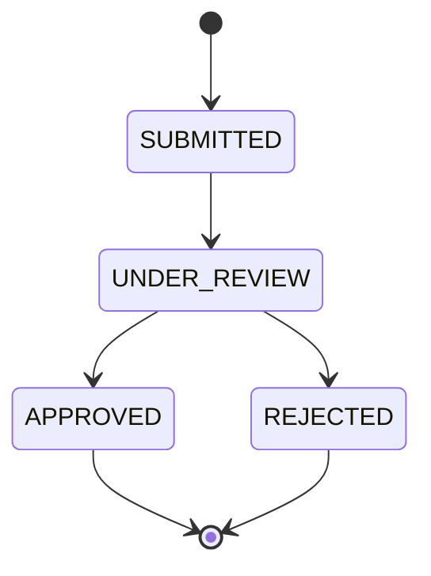

# Learning Notes 3: Loans and State Machines

These notes explain the loan module. The main ideas are a state machine, keeping the rules inside the object, and putting an external service behind an interface.

Each lesson gives the idea, the reason, the code from this project, a common mistake, and a sentence you can use in an interview.

The technical reference for the same module is in [docs/03-loans.md](../docs/03-loans.md).

## Lesson map

| Lesson | Concept | Where it appears |
|---|---|---|
| 1 | A state machine | `LoanStatus` |
| 2 | Rules inside the enum | `canTransitionTo` |
| 3 | One door to change state | `LoanApplication.moveTo` |
| 4 | Dependencies behind an interface | `CreditScoreClient` |
| 5 | Simulating an external service | `SimulatedCreditScoreClient` |
| 6 | A decision rule as constants | `LoanService` |
| 7 | One transaction for the whole decision | `LoanService.apply` |
| 8 | A rejection is a result, not an error | `POST /loans` returns `201` |

---

## Lesson 1: A state machine

**Idea.** An object can be in one of a few named states, and it can only move between them along defined paths.

**Why it matters.** Without a state machine, code can set any status at any time. An application could go from `REJECTED` straight to `APPROVED`, and nothing would stop it.

**Diagram.**


**Code.**
```java
public enum LoanStatus {
    SUBMITTED,
    UNDER_REVIEW,
    APPROVED,
    REJECTED
}
```

**Interview line.** "A loan is modeled as a state machine with four states. Only defined transitions are allowed, so an approved loan can never become rejected."

---

## Lesson 2: Rules inside the enum

**Idea.** The rules about which move is allowed belong next to the states they describe.

**Code.**
```java
public boolean canTransitionTo(LoanStatus next) {
    return switch (this) {
        case SUBMITTED -> next == UNDER_REVIEW;
        case UNDER_REVIEW -> next == APPROVED || next == REJECTED;
        case APPROVED, REJECTED -> false;
    };
}
```

**Two details.**
- `switch` with `->` is the modern form. It has no fall-through, so each case is independent.
- Every enum value must appear. The compiler checks this, so adding a new state later forces a decision about it.

**Common mistake.** Writing the rules as a long chain of `if` statements in the service. The rules then drift apart from the states.

**Interview line.** "The allowed transitions are a switch expression in the enum itself, so the compiler makes sure every state has a rule."

---

## Lesson 3: One door to change state

**Idea.** There must be exactly one method that changes the status, and it must check the rule before changing anything.

**Code.**
```java
public void moveTo(LoanStatus next) {
    if (!status.canTransitionTo(next)) {
        throw new IllegalStateException("Cannot move loan from " + status + " to " + next);
    }
    this.status = next;
    this.updatedAt = Instant.now();
}
```

There is no `setStatus`. The status field is private, and the only way to change it is `moveTo`.

**Why `IllegalStateException`?** A forbidden move is a bug in the code, not a mistake by the user. The user never chooses a status. So this is a programming error, not a business rejection.

**Interview line.** "The status can only be changed through one method that validates the transition first, so an illegal state is impossible to reach through normal use."

---

## Lesson 4: Dependencies behind an interface

**Idea.** The loan service needs a credit score. Where the score comes from is a separate question.

**Code.**
```java
public interface CreditScoreClient {
    int fetchScore(String applicantEmail);
}
```

`LoanService` depends on this interface, not on a concrete class. Spring provides the implementation.

**Why it matters.** Today the score is simulated. Tomorrow it could come from an HTTP partner. The service code does not change, and tests can use a fake.

**Common mistake.** Calling an HTTP client directly inside the service. Then the service cannot run without the partner, and tests become slow and fragile.

**Interview line.** "The external credit bureau is behind an interface, so the business logic does not depend on how the score is fetched."

---

## Lesson 5: Simulating an external service

**Idea.** A simulation gives predictable answers, so the rest of the system can be built and tested before the real service exists.

**Code.**
```java
@Component
public class SimulatedCreditScoreClient implements CreditScoreClient {

    @Override
    public int fetchScore(String applicantEmail) {
        int base = 600;
        int variation = Math.floorMod(applicantEmail.hashCode(), 201);
        return base + variation;
    }
}
```

The score is between 600 and 800. The same email always gets the same score, because `hashCode` is stable for the same text.

**Why `Math.floorMod`?** `hashCode` can be negative. `floorMod` always returns a value from 0 to 200.

**Interview line.** "I used a deterministic simulation for the credit score, so the decision flow is testable without an external dependency."

---

## Lesson 6: A decision rule as constants

**Idea.** Business thresholds should be named, so they can be read and changed easily.

**Code.**
```java
private static final int MIN_APPROVAL_SCORE = 650;
private static final BigDecimal MAX_APPROVED_AMOUNT = new BigDecimal("50000.0000");

boolean approved = score >= MIN_APPROVAL_SCORE && amount.compareTo(MAX_APPROVED_AMOUNT) <= 0;
```

Two things to notice:
- The amount is compared with `compareTo`, not `<=`, because it is a `BigDecimal` (lesson 10 of the accounts notes).
- The rule is written as one expression, so it is easy to read as a sentence: approve when the score is high enough and the amount is within the limit.

**Known gap.** These values are hard-coded. Moving them to configuration would allow changes without a rebuild.

**Interview line.** "The approval rule is two named thresholds, and both must be satisfied, so the decision is easy to audit."

---

## Lesson 7: One transaction for the whole decision

**Idea.** The application goes through several steps. The database should record the final result together with its inputs, never a half-finished state.

**Code.**
```java
@Transactional
public LoanApplication apply(String applicantEmail, BigDecimal amount) {
    User applicant = findUserByEmail(applicantEmail);

    LoanApplication loan = loanRepository.save(new LoanApplication(applicant, amount));
    loan.moveTo(LoanStatus.UNDER_REVIEW);

    int score = creditScoreClient.fetchScore(applicantEmail);
    loan.recordCreditScore(score);

    boolean approved = score >= MIN_APPROVAL_SCORE && amount.compareTo(MAX_APPROVED_AMOUNT) <= 0;
    loan.moveTo(approved ? LoanStatus.APPROVED : LoanStatus.REJECTED);

    return loan;
}
```

Because of `@Transactional`, the intermediate states are never committed alone. If the score call fails, the whole application is rolled back, and no half-decided loan remains.

**Common mistake.** Saving after each step in separate transactions. A crash in the middle would leave loans stuck in `UNDER_REVIEW` forever.

**Interview line.** "The whole loan decision runs in one transaction, so a failure leaves no half-decided application behind."

---

## Lesson 8: A rejection is a result, not an error

**Idea.** A rejected loan is a valid business outcome. It is not a failure of the request.

**Code.**
```java
@PostMapping
public ResponseEntity<LoanResponse> apply(@AuthenticationPrincipal Jwt jwt,
                                          @Valid @RequestBody SubmitLoanRequest request) {
    LoanApplication loan = loanService.apply(jwt.getSubject(), request.amount());
    return ResponseEntity.status(HttpStatus.CREATED).body(LoanResponse.from(loan));
}
```

The request succeeds with `201`. The body contains `"status": "REJECTED"`. The client reads the outcome from the data, not from the status code.

**Why this matters.** Returning `422` or `403` for a rejection would blur the difference between "the request was wrong" and "the answer was no".

**Interview line.** "A rejected loan is a successful request with a rejected result. Status codes describe the request, and the status field describes the business outcome."

---

## Summary

| Problem | Solution |
|---|---|
| Status can jump to any value | state enum with `canTransitionTo` |
| Code changes status directly | one method, `moveTo`, validates first |
| Credit bureau is unavailable or changes | interface, with a simulated implementation |
| Half-decided loans after a crash | one transaction for the whole decision |
| Hidden business rules | named thresholds |
| Rejection looks like an error | `201` with status `REJECTED` |
