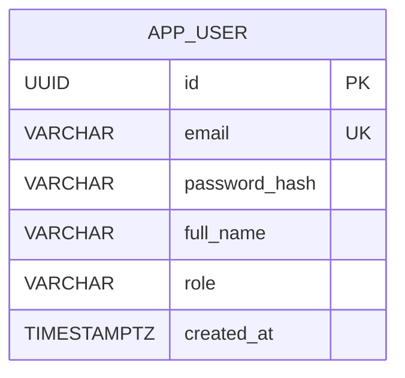
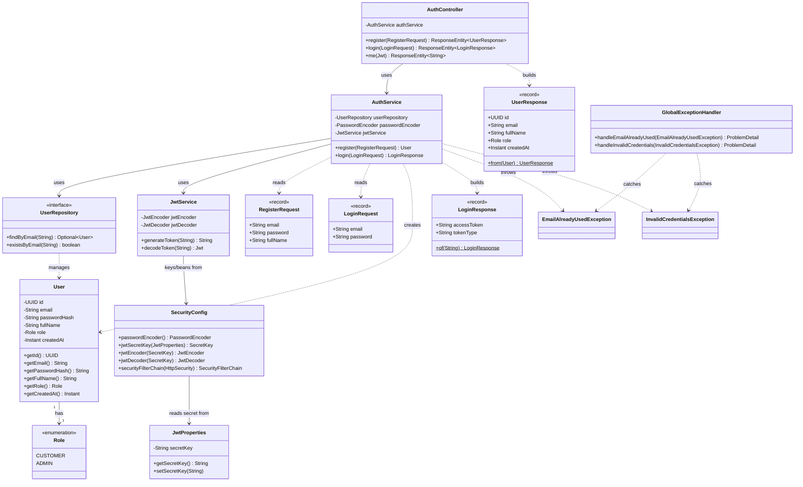
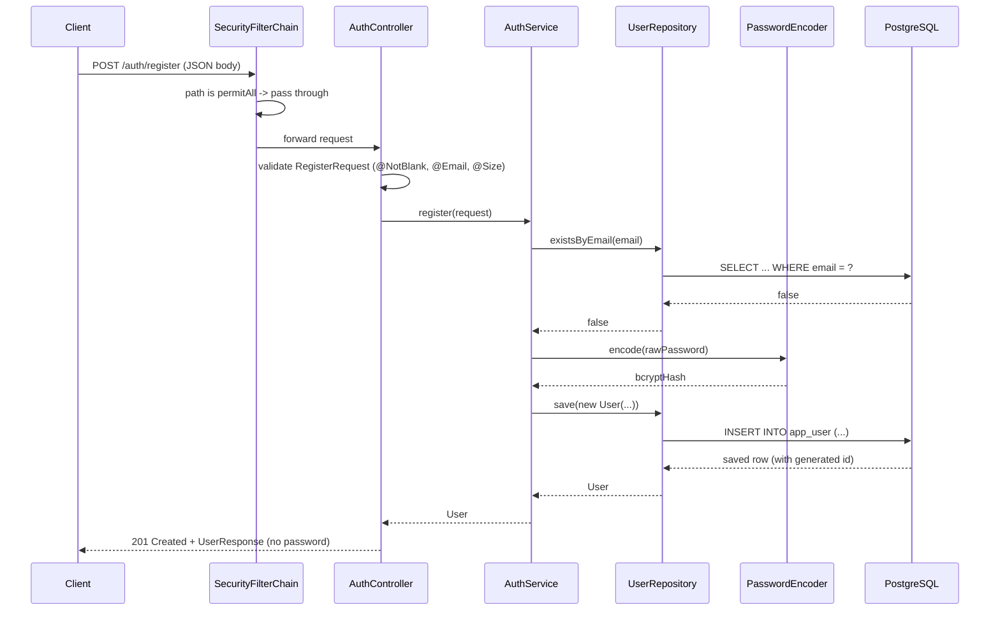
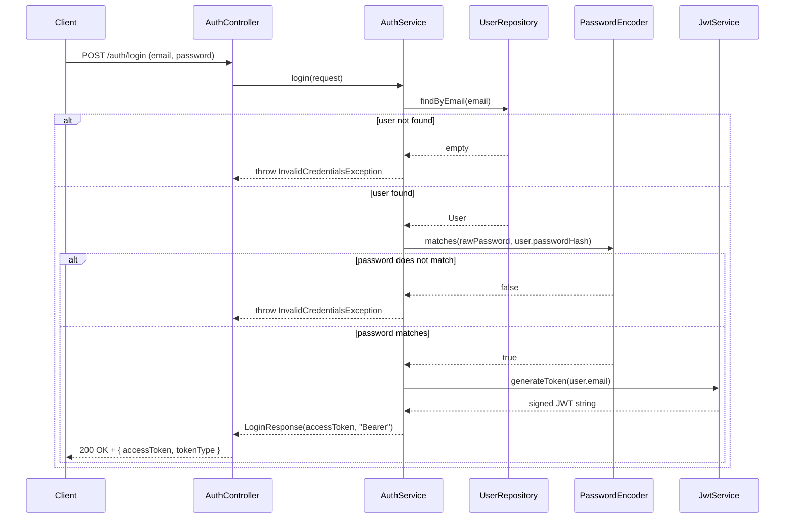
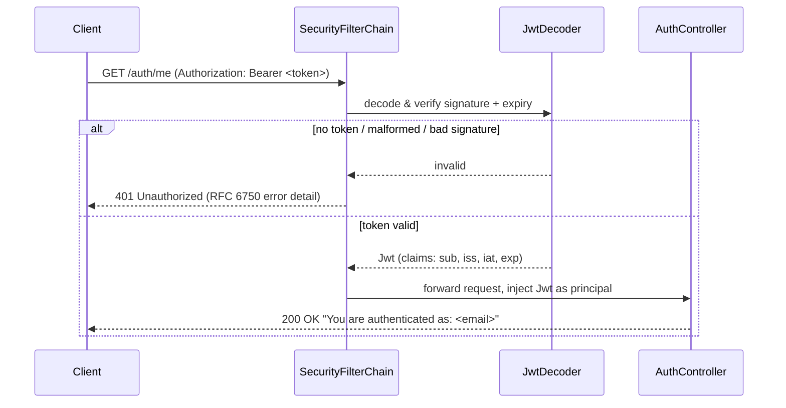

# Part 1 — Auth Module (Register, Login, JWT)

**Status:** ✅ Complete and tested end-to-end.
**Packages:** `dev.nikan.ledgerlite.auth`, `dev.nikan.ledgerlite.user`, `dev.nikan.ledgerlite.config`, `dev.nikan.ledgerlite.common`

## 1. What this module does

- Lets a new user register with an email, password, and full name.
- Hashes the password with BCrypt before it ever touches the database.
- Lets a registered user log in and receive a short-lived JWT.
- Protects every endpoint except `/auth/register`, `/auth/login`, and `/actuator/health` — any other request needs a valid `Authorization: Bearer <token>` header.
- Returns clean, standardized errors (RFC 9457 `ProblemDetail`) instead of leaking stack traces or generic 500s.

## 2. ERD — Database schema

Only one table exists so far (`V1__create_app_user.sql`). It will grow as Accounts, Transfers, and Loans are built.

Notes:
- `id` is a UUID (not a sequential integer) so account IDs are never guessable.
- `email` has a `UNIQUE` constraint — enforced by the database itself, not only by application code.
- `role` has a `CHECK (role IN ('CUSTOMER', 'ADMIN'))` constraint — same idea, a second line of defense.
- `password_hash` never stores a raw password — only a BCrypt hash (`{bcrypt}$2a$10$...`).

## 3. Class diagram

This reflects the real classes and their actual dependencies (constructor injection), not an idealized version.

## 4. Sequence diagram — Register

## 5. Sequence diagram — Login

Note: whether the email doesn't exist or the password is wrong, the client gets the exact same error message ("Invalid email or password") — this prevents an attacker from figuring out which emails are registered (a "user enumeration" attack).

## 6. Sequence diagram — Calling a protected endpoint (`GET /auth/me`)

## 7. Error handling flow

Any `RuntimeException` thrown by a controller method is intercepted by `GlobalExceptionHandler` (`@RestControllerAdvice`) before Spring Boot's default `/error` machinery ever sees it, and turned into an RFC 9457 `application/problem+json` response:

| Exception | HTTP status | When |
|---|---|---|
| `EmailAlreadyUsedException` | 409 Conflict | Registering with an email that's already taken |
| `InvalidCredentialsException` | 401 Unauthorized | Login with an unknown email or a wrong password |

**A real gotcha we hit:** before `GlobalExceptionHandler` existed, an uncaught exception was silently forwarded by Spring Boot to `/error` — but `/error` wasn't in the security allowlist, so Spring Security rejected that internal forward with a confusing bare `403 Forbidden`, hiding the real problem. Catching exceptions ourselves, before they ever reach `/error`, fixed it.

## 8. Key design decisions (and why)

| Decision | Why |
|---|---|
| UUID primary keys | Unguessable — an attacker can't enumerate users by incrementing an ID |
| BCrypt via `DelegatingPasswordEncoder` | Industry-standard one-way hashing; the `{bcrypt}` prefix allows upgrading algorithms later without breaking existing users |
| Role hardcoded to `CUSTOMER` server-side | The client can never register itself as `ADMIN` — `RegisterRequest` doesn't even have a `role` field |
| Same error for "email not found" and "wrong password" | Prevents user enumeration attacks |
| JWT via Spring Security's built-in `JwtEncoder`/`JwtDecoder` (Nimbus) | No extra JWT library needed — one less dependency to secure and maintain |
| Stateless JWT auth, CSRF disabled | CSRF protects cookie/session-based apps; a stateless bearer-token API isn't vulnerable to it |
| Flyway for schema, `ddl-auto: none` | The schema is versioned and reviewable like code — Hibernate never silently changes it |
| DTOs (`RegisterRequest`, `UserResponse`, ...) instead of exposing `User` directly | Full control over what the API accepts and returns; `passwordHash` can never leak |
| `@RestControllerAdvice` + `ProblemDetail` (RFC 9457) | One consistent, standard error format across the whole API |
